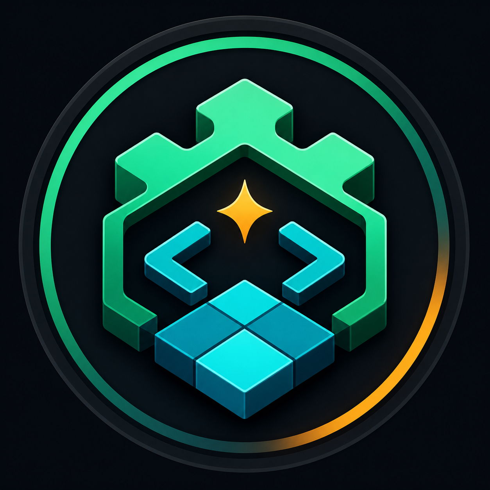

<p align="center">
  
</p>

<h1 align="center">GodotMaker</h1>

<p align="center">
  带着你的想法来，交给 GodotMaker，得到一个可运行的游戏。
</p>

<p align="center">
  <a href="LICENSE"></a>
  <a href="https://godotengine.org"></a>
  <a href="https://github.com/RandallLiuXin/GodotMaker/actions/workflows/ci.yml"></a>
  <a href="https://RandallLiuXin.github.io/GodotMaker/zh/"></a>
</p>

[English](README.md) | **中文**

## 为什么做这个

在游戏开发中，尤其是早期立项/市场验证阶段，一个团队往往会同时提出大于团队人数的idea。之前的做法是通过开发反复讨论最终选定一个idea，然后进行开发验证。结果还常常开发两周后才发现这个idea根本不行，之前的讨论和开发都白费了。因此我开发了 GodotMaker，希望能让单人把想法变成可玩的原型，快速验证想法的可行性和有趣程度。这将极大地加速游戏开发的前期阶段，让开发者更快地找到真正值得投入的游戏创意。

## 为什么是GodotMaker

很多工具都在承诺“AI 帮你做游戏”，但真正开始用之后，经常会遇到这些问题：

- 你只是想实现一个想法，却要一直坐在电脑前测试、截图、反馈，让 Agent 一步步改到能用。
- 平台说是在为你实现游戏，但代码和项目留在服务器上，无法完整下载，也无法脱离平台继续开发。
- 好不容易做出一个有趣 demo，却没有落在成熟游戏引擎里，后续迭代、调试、扩展和发布都很困难。
- 本质上只是一个开发工作流，却在中间转卖高价 token，把你锁进他们的计费和运行环境。

GodotMaker 选择另一条路：你带着游戏想法来，它协助你整理成 GDD，然后自动驱动 Agent 完成规划、实现、测试、运行、截图评估和修复。几个小时后，你验收的是一个真正落在本地的 Godot 项目。

项目代码在你手里，框架工作流源码可用、本地优先。想继续打磨，就继续完善想法或 GDD，再跑下一轮。

## 它有什么不同

- **默认 no-human-in-the-loop。** 类似 coding agent 的 long-running goal/task 模式，说清目标后让它自主持续推进。
- **自然语言到完整游戏项目。** 输入可以从一个游戏想法开始，GodotMaker 会协助把它整理成设计契约。
- **代码属于你。** 输出是普通 Godot 项目：源码、场景、资源、测试、截图、报告都在本地。
- **通过设计持续迭代。** 不是一次性生成后结束，而是可以不断完善想法或 GDD、不断提升游戏效果。
- **基于成熟引擎。** 结果落在 Godot 生态里，可以继续调试、扩展、导出和发布。
- **没有中间商赚差价。** GodotMaker 是工作流层，不通过封闭平台转卖 agent 工作。
- **源码可见的自动化流程。** 框架公开可查看，可在许可范围内运行、修改和贡献。
- **GodotMaker CLI驱动。** 提供命令行工具，方便你更好的全自动化的使用 GodotMaker 工作流。

Claude Code、Codex、Gemini、OpenAI、xAI、Tripo 等外部 runtime 或模型 provider 可能有自己的价格、额度和数据政策。GodotMaker 保证的是框架工作流源码可用、项目本地、产物归你。

## Agent 会做什么

一次运行中，GodotMaker Agent 会持续把设计往前推进：

- 把你的想法整理成 `GDD.md`、任务、场景、资产、系统和验收标准
- 在 Godot 中实现玩法
- 写代码的同时编写 gdUnit4 单元测试
- 编写像玩家一样操作游戏的端到端测试
- 运行游戏并截图
- 对照 GDD 检查结果
- 把缺失玩法、UI 问题、视觉问题送回修复循环

一个小型原型通常需要 **5-8 小时的 Agent 运行时间**。不过你不需要手动驱动每个阶段，也不需要一直守在电脑前，工作流会自己持续推进。

## 社区

- 【GodotMaker】：https://qm.qq.com/q/z6huEnumru

## 快速开始

```bash
npm install -g godotmaker-cli

mkdir my-game
cd my-game

# 带着你的游戏想法，然后运行：
godotmaker-cli --agent claude-code
```

同一个工作流也可以使用 Codex 或 OpenCode：

```bash
godotmaker-cli --agent codex
godotmaker-cli --agent opencode
```

CLI 会从 idea 梳理和 GDD 规划开始驱动工作流，直到生成一个可玩的 Godot 原型。Agent 选择顺序是：`--agent`、项目 `.godotmaker/config.yaml`、CLI 全局配置 `~/.godotmaker/cli/config.yaml`、默认 runner。高级用户仍然可以直接在 Claude Code 中运行 `/gm-*`、在 Codex 中运行 `$gm-*`，或在 OpenCode 中运行 `/gm-*`。

如果你要开发 GodotMaker 框架本身：

```bash
git clone https://github.com/RandallLiuXin/GodotMaker.git
cd GodotMaker
pip install -r tools/requirements.txt
python tools/check_env.py
```

## 你需要准备

| 工具 | 用途 |
|---|---|
| [Godot 4.5+](https://godotengine.org) | 运行生成出的项目 |
| [Claude Code](https://claude.ai/code)、[Codex](https://openai.com/codex/) 或 [OpenCode](https://opencode.ai/) | Agent runtime |
| Node.js 22+ | 运行 `godotmaker-cli` 和 Godot MCP 工具 |
| Python 3.10+ | 运行 GodotMaker 辅助脚本 |
| Git 2.30+ | 提供本地历史和 Agent worktree |

只有当项目配置选择 API provider 时，才需要设置对应 API key。只有在当前 Agent runtime 支持时，图片生成和视觉 QA 才能走 runtime-native 路径；OpenCode 项目应配置为 `codex` 或 API 后端图片/VQA provider。

## 了解更多

- [安装](https://RandallLiuXin.github.io/GodotMaker/zh/wiki/01-getting-started/installation/)
- [你的第一款游戏](https://RandallLiuXin.github.io/GodotMaker/zh/wiki/01-getting-started/first-game/)
- [工作原理](https://RandallLiuXin.github.io/GodotMaker/zh/wiki/02-concepts/how-it-works/)
- [常见问题](https://RandallLiuXin.github.io/GodotMaker/zh/wiki/04-troubleshooting/common-problems/)
- [路线图](ROADMAP.md)
- [完整文档](https://RandallLiuXin.github.io/GodotMaker/zh/)

## 状态与边界

GodotMaker 正在准备源码可见的 public alpha。CLI、Agent runner 支持、视觉 QA 和打包流程还会快速迭代。当前功能生成通常是最稳定的部分。但由于 AI 产出仍然存在不稳定性，并且美术管线仍处于 alpha 阶段，完整运行结束后，项目可能仍需要通过 coding agent 做一轮后续调整，例如修复错误图集区域、补齐动画配置，或修正资源绑定问题。

当前边界：

| 能力项 | 当前状态 | 备注 |
|---|---|---|
| 仅支持 2D | 当前框架面向 2D Godot 游戏。 | 不建议从 3D 游戏 prompt 开始。如果需要 3D 内容，可以在生成后手动补充。 |
| 关卡生成 | 关卡制游戏可以制作，但自动关卡设计能力还不稳定。 | 把生成出的关卡视为草稿或占位，后续仍需要手动调整布局。 |
| 解谜设计与数值平衡 | Agent 可以实现解谜机制、计分规则、经济系统接口和胜负逻辑，但它没有人类对于“是否好玩”“谜题是否巧妙”“数值曲线是否舒服”的判断。 | 用 GodotMaker 搭出功能系统，再自己补充谜题内容、关卡数据和数值平衡。 |
| 美术管线 | 美术管线仍处于 alpha 阶段。它可以生成并接入草稿资源，但偶尔会选错图集区域、漏掉动画配置，或需要后续 coding agent 修复资源绑定。 | 生成结束后建议实际打开项目检查视觉表现。视觉方向重要时，可以替换 `assets/` 下的资源，或重新运行 `/gm-asset`。 |
| 像素画风 | 美术管线当前暂不支持像素画风，后续会支持。 | 现阶段建议使用非像素 2D 美术风格，或手动提供自己的像素资源。 |
| TileMap | 当前暂不支持 TileMap。基于地块的地形、tileset、tile atlas 和网格地图生成不一定能自动完成。 | 现阶段优先使用手工场景或简单生成布局。TileMap 支持会在后续补充。 |
| 音频生成 | 当前 pipeline 暂不支持。音频资源会被视为用户提供或延期。 | 手动准备音乐和音效，并在音频工作流完成前自行接入项目。 |
| 长时间自动运行 | GodotMaker 对成本敏感，因为它会长时间调用 coding agent。当前内部基准是 Codex Pro 可以比较轻松地完成长时间原型运行，并且通常仍有不少剩余额度。 | 如果使用其他 runtime 或套餐，建议先从更小的 prompt 开始，并观察第一次完整运行。 |
| 无法收敛 | 基于当前用户反馈，极小概率下会出现无法收敛的项目。这里的“不收敛”指至少运行 5 轮 build/fix/evaluate 循环后仍然无法通过验收。 | 如果遇到这种情况，欢迎把本地不收敛案例反馈给我，这类案例对后续迭代很有价值。 |

后续计划提供专门的美术资源制作 UI，让筛选、裁剪、替换和审查更可靠。

如果你觉得这个方向有价值，欢迎 star、试用 CLI，并把你希望它做得更好的游戏类型和问题提到 issue。

## 运行时说明

GodotMaker 本身是一个工作流层，实际执行依赖外部 Agent runtime。这些 Agent 不是本仓库维护的组件，长时间自动化运行时偶尔会遇到运行时自身的小问题，例如静默超时、非输出式自动化任务已经完成但进程没有主动退出、临时工具失败、速率限制，或子进程需要额外清理。

绝大多数一次性的 Agent 失败都可以通过停止当前运行、重新启动 `godotmaker-cli` 恢复；工作流会根据本地项目状态继续推进。我们非常欢迎提交 feedback 和 issue，如果能附上当次运行的必要信息和项目里的 `.godotmaker/` 目录就更好了。

## 许可证

Business Source License 1.1。见 [LICENSE](LICENSE)。每个发布版本会在首次公开发布 4 年后自动转为 Apache License 2.0。**用 GodotMaker 做出来的游戏完全归属于你**，但仍需遵守第三方引擎、素材、模型 provider、runtime 或依赖项可能适用的条款。
