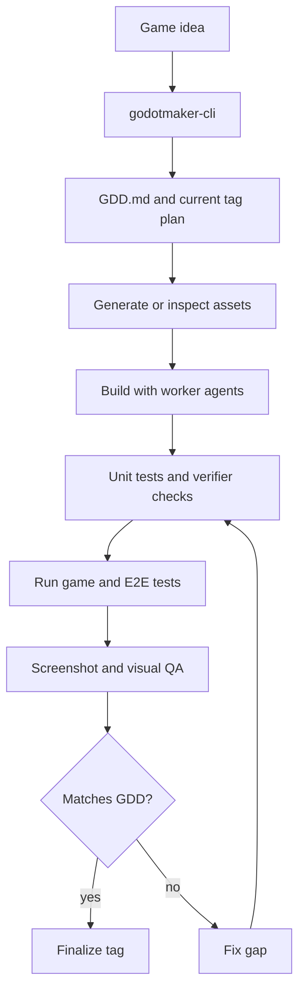

# How It Works

GodotMaker is an optimized agent workflow for building Godot games from an idea. The CLI helps turn the idea into a GDD, drives specialized roles, then loops through verification, gameplay evaluation, screenshot review, and fixes until the current design scope is complete.

The old manual mode still exists: advanced users can run `/gm-*` commands directly. The product direction is CLI-driven no-human-in-the-loop execution.

## The Four Phases

### 1. Plan

The workflow starts from your game idea. GodotMaker helps capture that idea as `GDD.md`, then turns the design into:

- `PLAN.md` - tasks for the current tag
- `STRUCTURE.md` - expected components, systems, and project structure
- `SCENES.md` - scene responsibilities and acceptance criteria
- `ASSETS.md` - required generated or provided assets

The GDD remains the design contract after idea capture. If you want a different game, refine the idea or edit the GDD and run the workflow again.

### 2. Build

Implementation is delegated to worker agents. Workers write game code and tests in scoped tasks rather than one large generation pass.

The build loop is deliberately strict:

- workers implement tasks from `PLAN.md`
- unit tests are written with the code
- a verifier runs headless Godot checks and gdUnit4
- reviewers check Godot-specific pitfalls such as physics, UI layout, animation, navigation, audio, shaders, particles, and tilemaps

This is why runs take hours instead of minutes: GodotMaker spends the time on verification and correction.

### 3. Evaluate

Verification proves that the project compiles and tests pass. Evaluation asks a different question: does the game actually match the design captured in the GDD?

The evaluator:

- launches the game
- writes or runs end-to-end tests
- simulates player-like actions
- captures screenshots
- checks visual and UI issues against the design
- writes structured findings

This catches problems that compile-time checks miss: overlapping UI, missing game-over flow, unreadable prompts, broken progression, or visuals that do not match the scene requirements.

### 4. Fix and Finalize

When evaluation finds a gap, `/gm-fixgap` creates a fix plan and dispatches workers to close it. The workflow then loops back through verification and evaluation.

When the current design scope passes, GodotMaker finalizes the tag:

- archives planning docs under `docs/tags/<Tag>/`
- writes `.godotmaker/final_report.json`
- records a local git tag
- resets per-tag runtime state

You can then refine the idea or edit the GDD and start the next tag.

## What Makes It Different

### No-Human-In-The-Loop by Default

GodotMaker is designed so the CLI can keep working after the idea has been clarified into a design. The agent asks for human input when the design itself is unclear, but implementation, tests, evaluation, screenshots, and fixes are intended to run automatically.

### TDD and E2E Are Part of the Workflow

Tests are not optional cleanup. Unit tests and E2E tests are part of the generation loop and become feedback for later agents.

### Visual Feedback Is a First-Class Gate

Godot games can pass tests and still look wrong. GodotMaker captures screenshots and uses visual QA to turn UI and scene problems into concrete fix tasks.

### Real Godot Output

The output is a normal Godot project. You are not locked into a hosted editor or a proprietary runtime.

For command-level details, see [The 9 roles](the-9-roles.md).
