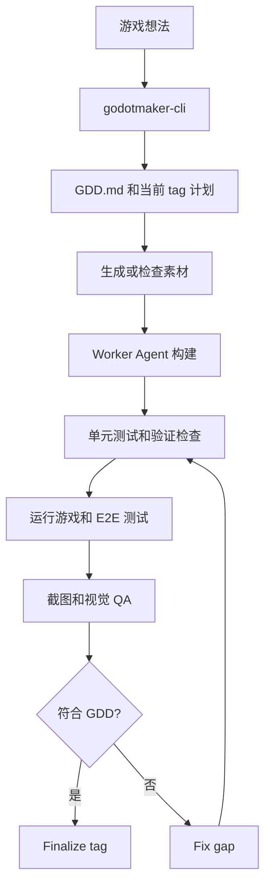

# 工作原理

GodotMaker 是一个面向 Godot 游戏开发优化过的 Agent 工作流。CLI 会协助把你的游戏想法整理成 GDD，驱动一组专门角色，然后反复执行验证、玩法评估、截图审查和修复，直到当前设计范围完成。

旧的手动模式仍然存在：高级用户可以直接运行 `/gm-*` 命令。产品方向是由 CLI 驱动的 no-human-in-the-loop 执行。

## 四个阶段

### 1. 规划

工作流从你的游戏想法开始。GodotMaker 会协助把想法整理成 `GDD.md`，再把设计转成：

- `PLAN.md` - 当前 tag 的任务
- `STRUCTURE.md` - 预期组件、系统和项目结构
- `SCENES.md` - 场景职责和验收标准
- `ASSETS.md` - 需要生成或提供的素材

GDD 是 idea capture 之后的设计契约。想做成不同的游戏，就继续完善想法或修改 GDD，再跑下一轮。

### 2. 构建

实现会派发给 Worker Agent。Worker 按 scoped task 写游戏代码和测试，而不是一次性生成一大坨代码。

构建循环是刻意严格的：

- Worker 根据 `PLAN.md` 实现任务
- 单元测试和代码一起写
- Verifier 无界面运行 Godot 检查和 gdUnit4
- Reviewer 检查 Godot 特有的易错点，例如物理、UI 布局、动画、导航、音频、shader、粒子和 tilemap

这就是为什么运行要花几个小时而不是几分钟：GodotMaker 把时间花在验证和纠正上。

### 3. 评估

验证证明项目能编译、测试能通过。评估问的是另一个问题：游戏是否真的符合 GDD 中捕获的设计？

评估器会：

- 启动游戏
- 编写或运行端到端测试
- 模拟玩家操作
- 截图
- 对照设计检查视觉和 UI 问题
- 写出结构化 findings

这能抓到编译期检查发现不了的问题：UI 重叠、game-over 流程缺失、提示不可读、进度断裂，或视觉效果不符合场景要求。

### 4. 修复和收尾

当评估发现 gap，`/gm-fixgap` 会创建修复计划并派发 Worker 关闭问题。之后工作流回到验证和评估。

当前设计范围通过后，GodotMaker 会 finalize 这个 tag：

- 把规划文档归档到 `docs/tags/<Tag>/`
- 写入 `.godotmaker/final_report.json`
- 记录本地 git tag
- 重置每 tag 的运行时状态

之后你可以继续完善想法或编辑 GDD，开始下一个 tag。

## 它有什么不同

### 默认 No-Human-In-The-Loop

GodotMaker 的设计目标是：当想法被澄清成设计后，CLI 可以继续推进工作。设计本身不清楚时，Agent 会请求人类输入；但实现、测试、评估、截图和修复都应该自动运行。

### TDD 和 E2E 是工作流的一部分

测试不是最后清理。单元测试和 E2E 测试是生成循环的一部分，并且会变成后续 Agent 的反馈。

### 视觉反馈是一等门禁

Godot 游戏可能通过测试但看起来仍然不对。GodotMaker 会截图，并用视觉 QA 把 UI 和场景问题变成具体修复任务。

### 真正的 Godot 输出

输出是普通 Godot 项目。你不会被锁进托管编辑器或专有运行时。

想看每条命令的细节，见 [9 个角色](the-9-roles.md)。
